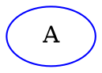
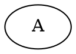

* can I classify the print functions into AST, "middle", primitive ones that actually call fmt? and
  limit where I call which? or reduce the number of the different p.print(), p.printString() ones?

* add test in dotfmt for

the AttrList can have an empty AList followed by a non-empty one (I have one in the parser_test.go)



this is also legal but the key/value pair is then an Attribute



am I parsing this correctly?

* improve error handling see [Parser](#parser)

* do I need the Stringer impls in the AST? would be great to get rid of extra code if not needed.
How to debug/trace then? see Gos trace in the parser. `./cmd/tokens/main.go` is of great help. I
want something similar for the parser. Is it best to integrate that into the scanner/parser or nicer
to keep it externally like `cmd/tokens`?

* Move cmd/tokens to example/cmd/tokens or example/tokens? Its not really something I would want to
  be used. Its a mere demo/debugging utility

* update README with docs on `dotfmt`
  * indentation: tabs
  * alignment: spaces
    * every comment starts with one space only, extra whitespace is removed
  * max number of utf8 characters per line 100
    * only if the indentation is < than ???
    * IDs are broken up into multiple lines and quoted if they were not already quoted
    * comments are broken up into multiple lines using the same marker that was used

    ```dot
        # comment that is too long
    ```

    turns into

    ```dot
        # comment that
        # is too long
    ```

* properly godoc all the things

* profile any of the above on a large file, generate a pprof dot file and feed that back into the
parser as a test via testdata


## Parser

* how to continue generating tokens when finding invalid ones? user the illegal token? how
  does treesitter do it? they have a missing node and an illegal one? Go has ast.BadExpr for
  example. Refresh mind on crafting interpreters panic mode. The parser can skip tokens until it finds
  a safe point. I think sync is used as the word. I think I also saw it in the Go parser or gofumpt.

For example

```dot
graph {  B
A/
}
```

The scanner can now emit A and then errors on `/`. dotfmt should be able to format this and return
the error(s) that `/` might miss another `/` or `*`.

* implement parser.Trace like the Go parser

* ../graphviz/graphs/directed/russian.gv is confusing as it clearly violates
unquoted string identifiers can contain alphabetic ([a-zA-Z\200-\377]) characters, underscores ('_') or digits([0-9]), but not begin with a digit
https://graphviz.org/doc/info/lang.html#ids

dot -Tsvg <../graphviz/graphs/directed/russian.gv > russian.svg

also works so is that language reference outdated?

* Lexical and Semantic Notes https://graphviz.org/doc/info/lang.html
  * should some of these influence the parser/should it err
  * how does strict affect a graph? no cycles? is that something my parser should validate?

* Where are commas legal?

* Are `{}` creating a lexical scope? This

```
{ node [shape=circle]
    a b c d e f g h  i j k l m n o p  q r s t u v w x
}
{ node [shape=diamond]
    A B C D E F G H  I J K L M N O P  Q R S T U V W X
}
```

sets the attributes on given nodes in the `{}` but will it affect nodes outside?

### API

* review all receivers decide on pointer or not
* is it nicer to work with slices then my choice of linked lists with *Next whenever there was a
recursive definition?
* should I remove the Directed field from EdgeRHS as that is clear from graph.Directed?
* make error messages more user friendly
  * for example when parsing the attr_stmt the attr_list is mandatory, instead of saying expected [
    I could say that

#### Nice to have

* expose the knowledge of quoted, unquoted, numeral, html identifiers?
* how complicated is it to use the bufio.Readers buffer instead of creating intermediate slices for
identifiers? how much would that even matter at the expense of how much code :sweat_smile:

### Language Feature Support

* support concatenating strings?
https://graphviz.org/doc/info/lang.html#comments-and-optional-formatting
> In addition, double-quoted strings can be concatenated using a '+' operator.
* lex html string

### Compatibility & Fault Tolerance

This does stop at the first error

```
echo 'graph{ !A; C->B }' | dot -Tsvg -O
Error: <stdin>: syntax error in line 1 near '!'
```

and is not precise about where the error is

```
echo 'graph{ C->B; @A }' | dot -Tsvg -O
Error: <stdin>: syntax error in line 1 near '->'
```

Null byte is not allowed in unquoted identifiers as per spec. It is also not supported in quoted
strings as shown by this error

```
echo -e 'graph{ "A\000--B" }' | dot -Tsvg -O
Error: <stdin>: syntax error in line 1 scanning a quoted string (missing endquote? longer than 16384?)
String starting:"A
```

### Hints

* "\n\n\n\t  - F" leads to "a numeral must have at least one digit" pointing to the whitespace
following the -. Is that understandable enough?
* add hints to some errors like <- did you mean ->
* non-breaking space between numerals leads to

echo 'graph{ 100 200 }' | dot -Tsvg -O
Warning: syntax ambiguity - badly delimited number '100' in line 1 of <stdin> splits into two tokens

## dotfmt

* bring back block comments
    * add a test for a multi-line comment like A -- B /* foo */; B -- C

* there should be an off by one error in my mind when it comes to printID as runeCount does not
include the separator \n and I decrement the endColumn to account for prevRune '\'. It does look
like its working though. editors do show different counts for columns :joy: which confuse me. I
guess column count can differ in terms of what they mean.

```go
if endColumn > maxColumn { // the word and \ do not fit on the current line
```

Alignment
* use https://nick-gravgaard.com/elastic-tabstops/
    * via https://pkg.go.dev/text/tabwriter
    * https://github.com/mvdan/gofumpt/issues/2
* how to treat newlines? right now they are discarded. Maybe I'd like to group/make blocks.
Allow users to do that. No more than one empty line though. And will that line be completely
empty or be indented as the surrounding code?
I need proper token/ast position. for this row and column
* improve breaking up long lines
  * Only the ID individually is considered right now. In this example `]` exceeds the maxCol

```dot
	"Node1234" [label="This is a test\nof a long multi-line\nlabel where the value exceeds the max col"]
```

* align multiple attribute values (and `=`)
	`"0" -- "1" -- "2" -- "3" -- "4" -- "0" [
		color = "blue"
		len   = 2.6
	]`
 should that then apply to the entire file :joy:? as global attributes can be set on the
graph/subraph as well
* make this prettier

```dot
	B [
		style="filled" //  this should stay with style="filled"
	]
```

the Attribute should go on a new line like above but it ends up looking like

```dot
	B [style="filled" // this should stay with style="filled"
	]
```

* allow multiple nodes on the same line? how to break them up when > maxCol

comments
    * merge adjacent comments?
    * how to align comments when I do break them up? right now they are not indented at all. indent to
    the level of the previous comment?

* do I need to shield against ASTs generated from code?
* implement isValid and Stringer on token.Position like Go does? the EOF token for example does not
  have a valid token.Position. For example when I don't have a closing '}' for a graph it does not
have a valid EndPos
  see Go ast.BlockStmt docs which mention exactly that
  could help with Nodes like `AttrList` which might be empty

* support parsing/formatting ranges
    * parser should be ok with comments before a graph. how to support that in terms of the parser
    API? right now it returns an ast.Graph but the leading comment comes before the ast.Graph
    Can I solve this requirement together with parsing of ranges?

```go
    Parse(io.Reader) ast.Node // at least right now there is no node that would fit the above

    Parse(io.Reader) []ast.Stmt // this could work. In most cases this will be a slice of
    // {ast.Graph} or {ast.Comment, ast.Graph} only but this could also work with parsing a
    // range
```

* test parser with invalid ID as ID for port. check the places were convert literals to
ast.ID without parsing the identifier, should I not parse it first?

* try formatting invalid dot and improve error handling
  * `2->4` leads to error
  "2:15: a numeral can only be prefixed with a `-`"
  allow that :) and turn it into `2 -> 4`
  * LexError return the token.Token.Start token.Position? or return the invalid token at some point?

improve
* handling of EOF better and move these special tokens up top like Go does

* count opening braces and brackets and decrement them on closing to validate they match?
or is that to simplistic as there are rules as to when you are allowed/have to close them?

* how to handle error on fmt.Fprint?
* how to handle errors?

* test using invalid input
  * invalid input should be printed as is, it should not delete user input!

* add profiling flags
    * capture profile formatting example dot files
    * capture profiles formatting the profile dot file
    * all of this to find any lingering bugs I have

* support formatting file/dirs in place
  * goroutines could be fun once its working ;)
  * format all of https://gitlab.com/graphviz/graphviz/-/tree/main/graphs?ref_type=heads
    * profile, anything obvious I could improve?
    * add a benchmark to ensure no regressions

  * gofumpt uses positional args as files and reads from stdin if non given
```go
    args := flag.Args()
    if len(args) == 0 {
```
* this is a hint on how gofumpt can format pieces of go
// If we are formatting stdin, we accept a program fragment in lieu of a
// complete source file.
fragmentOk = true

if tries `parser.ParseFile` and returns if there is no error
in case of an error it adds `package p;` and tries `parser.ParseFile` again
if that fails it assumes the src might be statements and wraps it in a package with a function and
tries to ParseFile again. It creates an adjustSrc func to adjust the src again afterwards. It also
uses `;` so line numbers stay correct.

I could also try parsing a Graph, if that fails due to an error in the parseHeader I could wrap it
in a `graph { }` assuming that the src is a []Stmt. This might fail if src contains directed edges
so I need to detect such errors and try with `digraph {}`.

### Features

* support subraph shorthand using `{}` and don't always print `subgraph`

* support + on IDs

* strip unnecessary quotes
  * unstripped ID would need to be a valid ID, imagine `"A->B"` quotes cannot be stripped here
  * is the "easiest" to try to parse the unquoted literal as ID and only if valid strip them

* join adjacent comments? unless there is an empty newline in between them

## Highl Level API

I would like to define dot graphs in Go without having to create an ast. Like

```go
dot.Graph{
    ID: "galaxy",
    Attributes: []dot.Attribute{
        dot.Attribute{
            Name: "",
            Value: "",
        }
    }
}
```

I then want to print that to `io.Writer` in dot format. I could achieve that by going from the above
to an `ast.Graph` then use the `Printer`.

Would also be great to go from an `ast.Graph` to a `dot.Graph`. Here I need to evaluate the `ast` as
attributes apply to the current "scope" in order.

Questions
* how to deal represent an `ast.ID`? If I just use a `string` in `dot.Graph.ID` it would lead to an
  invalid ID in the ast. Validate that before? Or deal with such errors later? Or sanitize myself?

## Ideas

* how could I make something like :InspectTree in neovim for my parser?
* write cmd/dothot hot-reloading a file passing it to dot and showing its svg in the browser
