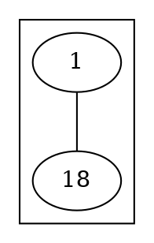

# TODO

* dotx fmt: add concurrency to printing files/dirs
  * use trace task for formatting dir and region for individual files

* profile fmt
  * `dotx fmt < samples-graphviz/share/examples/world.gv` is the most challenging
  * format entire graphviz dir
* profile lsp
  * `dotx fmt < samples-graphviz/share/examples/world.gv` is the most challenging

## Parser

* add recursion depth limit to prevent stack overflow on deeply nested subgraphs
* commas: the parser handles commas only in attribute lists (`[a=1, b=2]`) per the official DOT
  grammar. However, Graphviz itself is more permissive and accepts commas as statement/element
  separators elsewhere:
  * `a, b` - comma between statements (Graphviz accepts, grammar forbids)
  * `a -> b, c` - comma in edge RHS (Graphviz accepts, grammar forbids)
  * `{b, c}` - comma in node group (Graphviz accepts, grammar forbids)

  Decision: follow the grammar for now. Consider matching Graphviz's permissive behavior later if
  needed for real-world compatibility.

## fmt

* measure in original sets broken if text contains newline - not correct for raw strings?
  `foo\nfaa` in Go or similar with escaped newlines in DOT should not cause a newline. Add a new
  tag/attribute? rawtext, `<text raw/>` or don't implement that?
* support stanzas ./samples-graphviz/241_0.dot
  * how do I even know of newlines? Right now I don't generate Breaks based on the tokens
  * implement merging multiple Break() using max(n, m)
  * how to treat newlines? right now they are discarded. Maybe allow users to group/make blocks.
    No more than one empty line though. Need proper token/ast position with row and column.
* lex html string? or at least deal with it gracefully: see ./samples-graphviz/56.dot
* layout uses `len(tag.content)` (bytes) not rune count - may miscount width for non-ASCII
* improve breaking up long lines - only the ID individually is considered right now:

```dot
"Node1234" [label="This is a test\nof a long multi-line\nlabel where the value exceeds the max col"]
```

  In this example `]` exceeds the maxCol.
* support parsing/formatting ranges
  * gofumpt hint on formatting pieces of Go: tries `parser.ParseFile`, on error adds `package p;`
    and tries again. If that fails, wraps in package with function and tries ParseFile again.
    Uses `;` so line numbers stay correct. I could try parsing a Graph, if that fails wrap in
    `graph { }` assuming src is []Stmt. Might fail if src contains directed edges so detect and
    try with `digraph {}`.

## LSP

* look into debouncing diagnostics. delay publishing by ~100ms, cancel if another change
arrives. joining } of subgraph onto line above it causes brief flashes of errors as neovim sends an
insert and then a delete as separate changes



## CLI

## Testing

* add a benchmark to ensure no regressions
* can I use fuzzing?
  * or the https://graphviz.org/docs/cli/gvgen/

## Questions

* ../graphviz/graphs/directed/russian.gv is confusing as it clearly violates "unquoted string
  identifiers can contain alphabetic ([a-zA-Z\200-\377]) characters, underscores ('_') or
  digits([0-9]), but not begin with a digit" https://graphviz.org/doc/info/lang.html#ids
  `dot -Tsvg <../graphviz/graphs/directed/russian.gv > russian.svg` also works - is that language
  reference outdated?
* Lexical and Semantic Notes https://graphviz.org/doc/info/lang.html
  * should some of these influence the parser/should it err?
  * how does strict affect a graph? no cycles? is that something my parser should validate?

